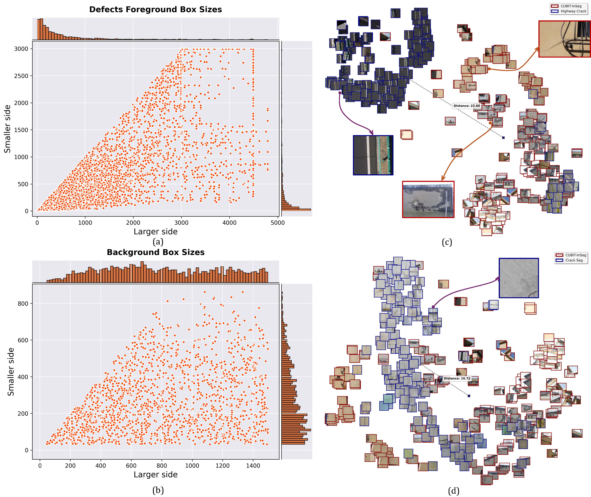
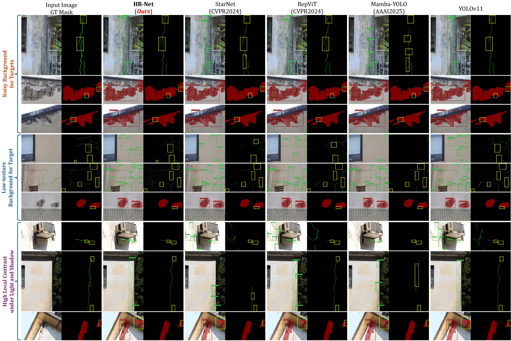
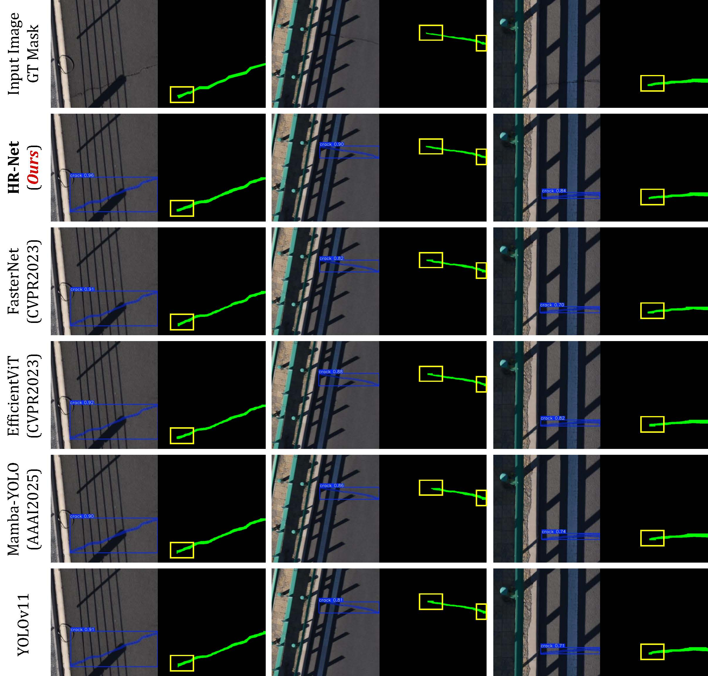
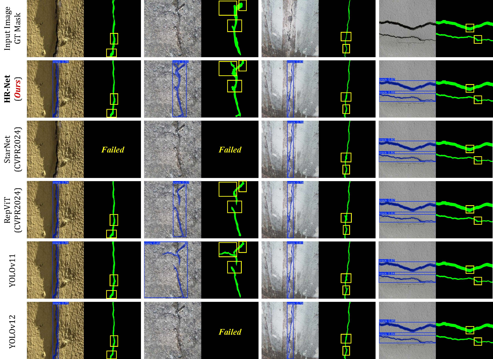
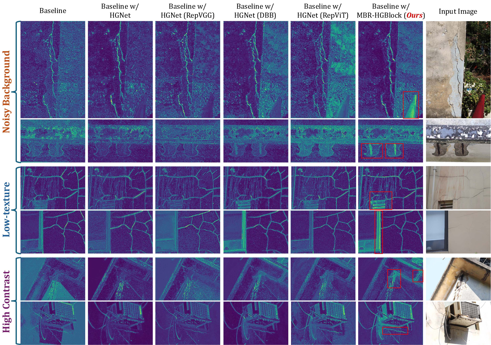
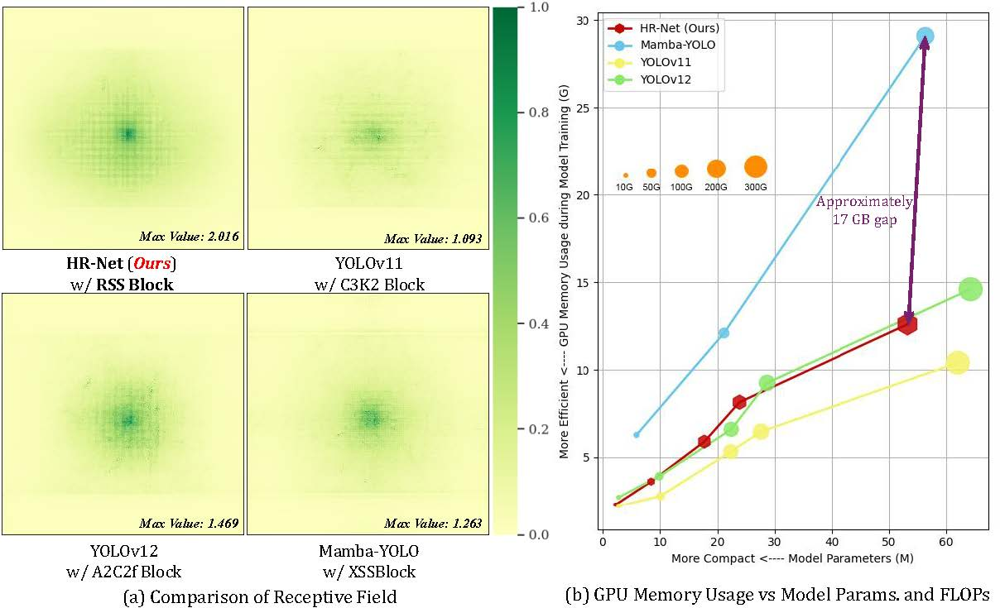
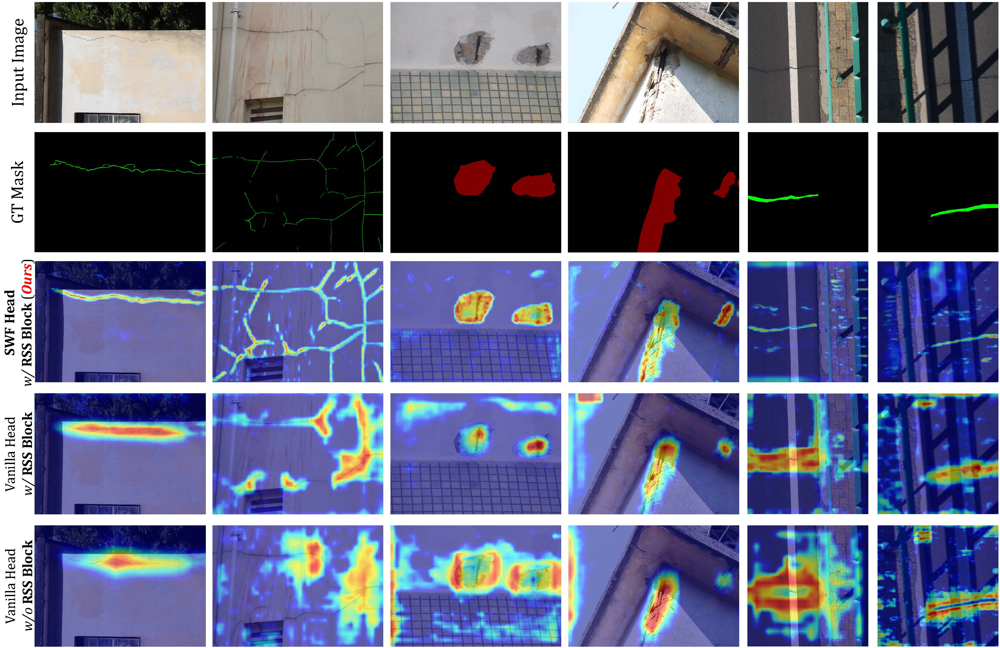
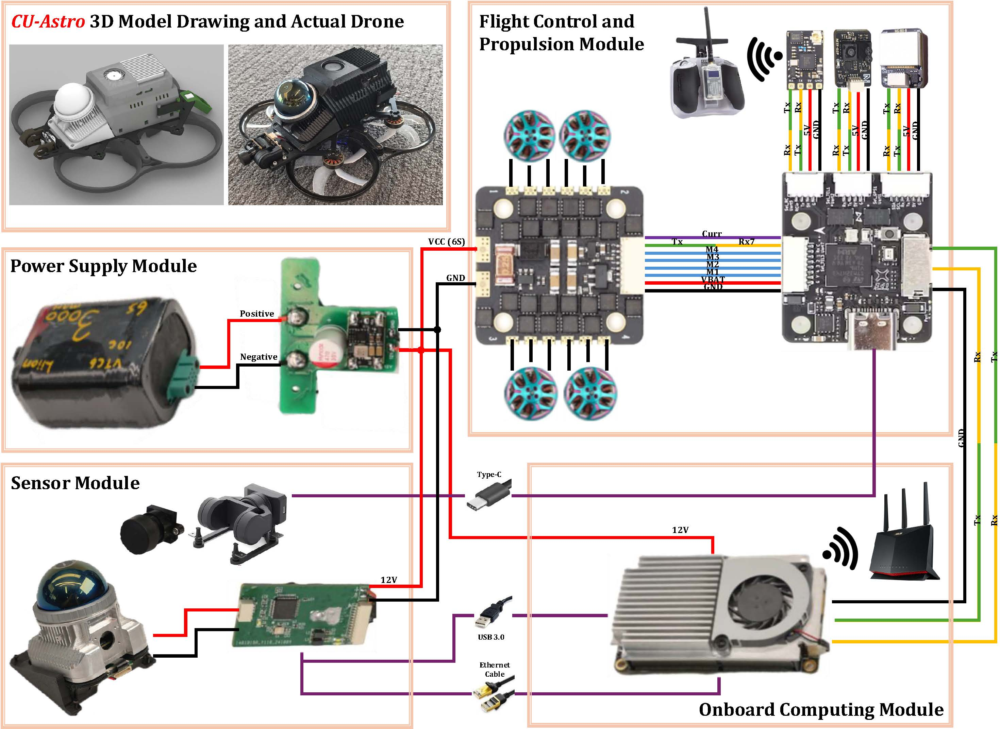

# Reparameterized Hybrid Instance Segmentation Network for Drone-based Real-time Multi-defect Infrastructure Inspection

### Dataset Distribution Comparison


### Benchmark Datasets Performance:
#### Our proposed CUBIT-InSeg dataset


#### Highway-Crack dataset


#### Crack-Seg dataset


### Ablation Experiment:
#### Heatmap Comparison of Backbone 


#### Receptive Field Comparison of Neck 


#### Gradient Comparison of Head 


### CU-Astro: Autonomous Compact Aerial Inspection Platform


### Video demonstration [▶️ Watch CU-Astro inspection demonstration video](https://drive.google.com/file/d/1aF60K5ictHUmy_rjEovKXsbXMP1cjLZ5/view?usp=drive_link)

## Usage of this repository
### Install
```python
# Conda environment: torch=2.2.0, CUDA=12.1
conda create -n hrnet python=3.10
conda activate hrnet

# Install ultralytics
# Our version is 8.3.9 which can be found in ./ultralytics/__init__.py
pip install ultralytics


# Install VMamba
cd ./ultralytics/nn/extra_modules/mamba
pip install causal-conv1d>=1.2.0
pip install mamba-ssm

# if encounter an error, refer make.sh to run 'python setup.py clean --all' first
python setup.py install 
```

### Train
```python
# Single GPU training
python train-seg.py > logs/HRNet-n-train.log 2>&1 & tail -f logs/HRNet-n-train.log

# Multi-GPUs training
python -m torch.distributed.run --nproc_per_node 2 train-seg.py > logs/HRNet-n-train.log 2>&1 & tail -f logs/HRNet-n-train.log
```

### Validate / Test
```python
# Ultralytics framework validation / test
python val-seg.py > logs/HRNet-n-val(test).log 2>&1 & tail -f logs/HRNet-n-val(test).log
```

### Output of the model
```python
# Export the model to ONNX format for further deployment
python export.py
```

### Inference 
```python
# Predict unknown images / videos
python infer-seg.py 
```

### Dataset in our work can be available at: <button style="background-color: #000000; color: white; margin: 0 auto; padding: 10px 15px;border: none; border-radius: 5px;"><a href="https://mycuhk-my.sharepoint.com/:f:/g/personal/1155145791_link_cuhk_edu_hk/Ep7cFAjk-XNKin8u6DiG_MoB8Yl-kaMfWlkjWQsYLz3qtw?e=cgLBys" style="color: white; text-decoration: none;">OneDrive</a> </button>


## Acknowledgement
This work was supported by the InnoHK of the Government of the Hong Kong Special Administrative Region via the Hong Kong Centre for Logistics Robotics.


## Citation
If you find this project helpful for your research, please consider citing our paper and giving a ⭐ of this repository.

Any questions or academic discussion, please contact me at: benyunzhao@berkeley.edu, byzhao@mae.cuhk.edu.hk
